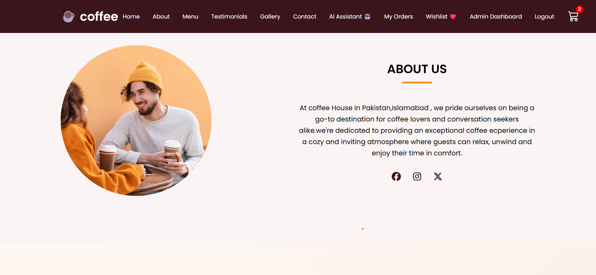
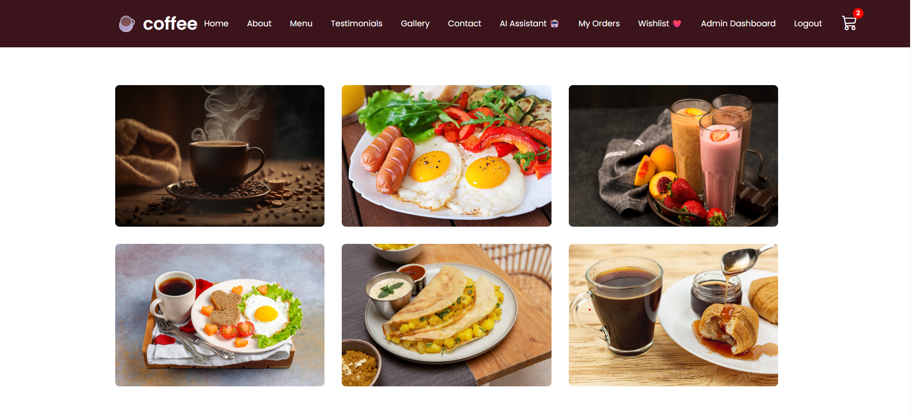
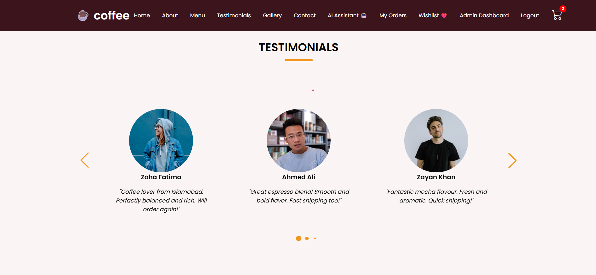
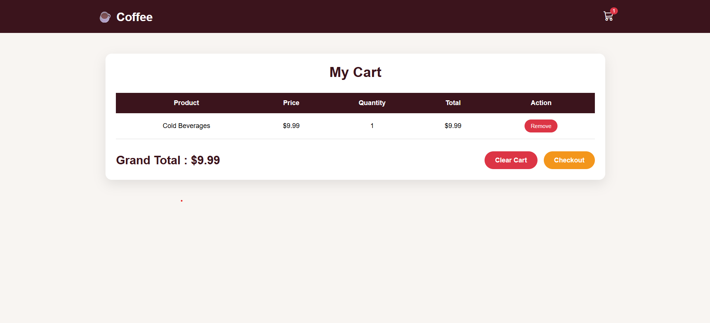

# ☕ AI Coffee Shop

A full-stack coffee shop web application built with HTML, CSS, JavaScript, Node.js, Express.js, and MySQL.

The project includes online ordering, user authentication, shopping cart, admin dashboard, and an AI-powered coffee recommendation feature.

## ✨ Features

- 🏠 Modern Coffee Shop Homepage
- 🔐 User Sign Up & Login
- 🛒 Shopping Cart & Wishlist
- 📦 Online Orders
- 👤 User Order Management
- 🛠️ Admin Dashboard
- ☕ Product Management
- 💬 Customer Messages
- 🤖 AI Coffee Recommendations
- 📱 Responsive Design

## 🛠️ Technologies

- HTML5
- CSS3
- JavaScript
- Node.js
- Express.js
- MySQL
- REST APIs
- Git & GitHub

## 🤖 AI Feature

The website includes an AI-powered coffee recommendation feature that recommends coffee options based on user preferences.

## 📸 Project Screenshots

### 🏠 Home Page

### 🔐 Login Page

### ☕ About Page

### 🛍️ Gallery

### 💬 Testimonials

### 🛒 My Cart

### 🤖 AI Assistant

### 🛠️ Admin Dashboard

## 📂 Project Structure

- `index.html` — Main website
- `loginpage.html` — Login & Signup
- `cart.html` — Shopping Cart
- `orders.html` — User Orders
- `admin.html` — Admin Dashboard
- `server.js` — Node.js/Express Backend
- `script.js` — Main Frontend Functionality
- `admin.js` — Admin Functionality

## 🚀 Project Status

Completed full-stack academic/personal project.

## 👩‍💻 Developer

**Zoha Fatima**  
BS Computer Science Student
